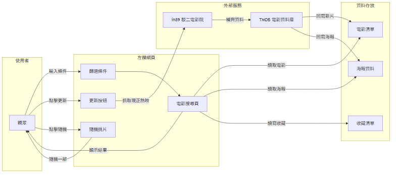
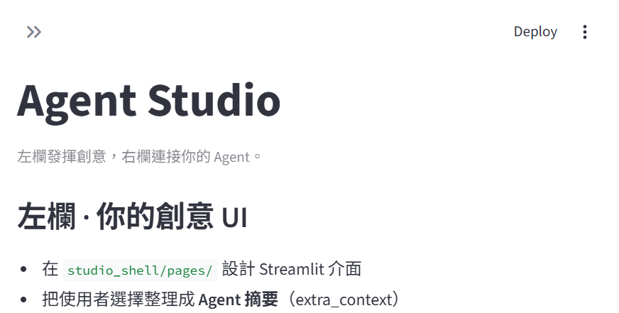
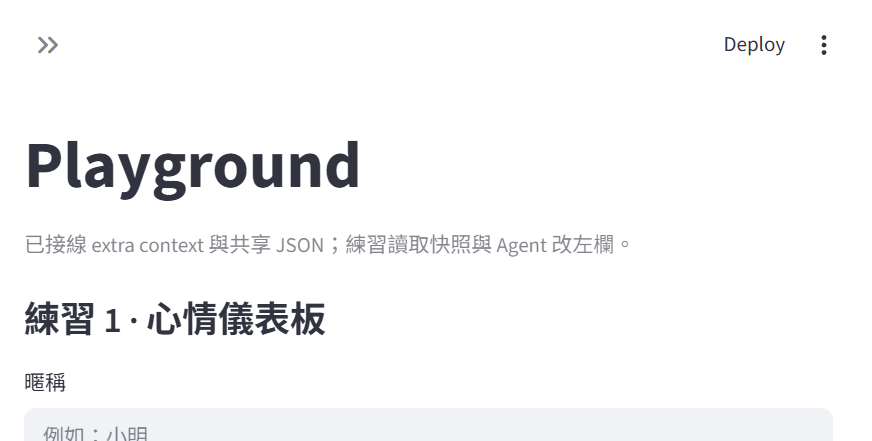
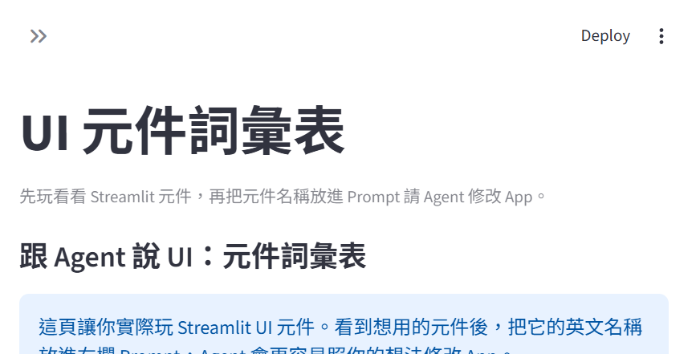

# 電影推薦

**日期**：2026-06-24

---

## 1. 專題介紹

- **專題名稱**：電影推薦
- **一句話功能**：輸入片名或篩選類型，搜尋台灣上映的電影
- **主要使用者**：想看電影的廣大觀眾
- **想解決的痛點**：
  - 想快速找到符合當下心情／情境的電影
  - 目前「感覺篩選」條件（心情、陪伴對象）有點少，想擴充

---

## 2. 學校 Server 環境

本專題透過學校提供的 API Key 呼叫 Ollama Router，由 Router 分配至後端 Ollama 節點執行 LLM。下圖為全班相同之 server 拓撲（報告不標示 Router 位址）。

---

## 3. 系統概覽

左欄 Streamlit 自訂頁的互動如下（本案以左欄自訂頁為主，未串接右欄 Agent）。

### 3.1 左欄自訂頁功能

- **更新**：按鈕觸發同步腳本去 in89 抓新片單
- **基本搜尋＋進階篩選**：讓使用者依條件挑電影
- **隨機篩選**：依使用者條件，由程式隨機挑一部
- **收藏清單**：收藏喜歡的電影並儲存到本地 JSON

### 3.2 資料流

- 使用者輸入條件 → 左欄 UI 讀取電影清單、海報資料、收藏清單
- 使用者點擊更新 → 同步腳本從 in89 抓現正熱映 → TMDB 補齊資料 → 回寫電影清單與海報
- 左欄 UI 顯示結果給使用者

### 3.3 完整互動例子

使用者先選條件（類型、心情、陪伴對象、年份、時長），介面依條件顯示適合的電影；按「隨機」可由程式從中挑一部。

---

## 4. 成果與創新

### 4.1 成果

- 搜尋（片名關鍵字）
- 篩選（類型、心情、陪伴對象、年份、時長）
- 隨機挑片
- 收藏電影
- in89 同步片單

### 4.2 創新／亮點

- 可以依照**現在的心情或觀影需求**來篩選電影（情境式篩選）

---

## 5. 技術含量

- **Streamlit** 多頁 UI 框架
- **JSONL 對話紀錄 + 記憶整合**
- **LangChain + OpenAI 相容 LLM**

---

## 附錄：Demo 截圖

### Home

### Playground

### UI 元件詞彙表

### 電影搜尋（本專題主頁）

---

展覽用綜整海報（另產）：`assets/專題海報.png`
